# Journey Dynamics — Architectural Review Board Document

| | |
|---|---|
| **Service** | Journey Dynamics |
| **Language** | Rust |
| **Repository** | `journey_dynamics` |
| **Date** | February 2026 |
| **Status** | Draft for ARB Review |

---

## Table of Contents

1. [Executive Summary](#executive-summary)
2. [Problem Statement](#problem-statement)
3. [Architectural Overview](#architectural-overview)
4. [Key Architectural Decisions](#key-architectural-decisions)
   - [Event Sourcing](#1-event-sourcing)
   - [CQRS](#2-cqrs-command-query-responsibility-segregation)
   - [GoRules Decision Engine](#3-gorules-zen-decision-engine)
   - [Rust](#4-rust-as-implementation-language)
5. [Domain Model](#domain-model)
6. [Data Flow](#data-flow)
7. [Schema & Validation Strategy](#schema--validation-strategy)
8. [Deployment & Infrastructure](#deployment--infrastructure)
9. [Trade-offs & Risks](#trade-offs--risks)
10. [Appendix: Technology Choices](#appendix-technology-choices)

---

## Executive Summary

**Journey Dynamics** is a backend service that orchestrates adaptive, forms-based user journeys. A "journey" guides a user through a sequence of data-capture steps — but, critically, the sequence is not fixed. As the user provides information about themselves and their objective, the system dynamically determines which steps to present next, what data to collect, and which products or services are relevant.

The service is built in Rust and employs three architectural patterns that, together, make it well suited to this problem:

| Pattern | Why it matters here |
|---|---|
| **Event Sourcing** | Every piece of data the user provides, every workflow decision, and every step transition is captured as an immutable event. This gives us a complete, auditable history of how a journey unfolded — essential for compliance, debugging, and analytics in a system where no two journeys are alike. |
| **CQRS** | Separating the write path (commands that produce events) from the read path (materialised views for the UI) lets us optimise each independently. The write side enforces business rules; the read side provides fast, purpose-built query models shaped for the front-end. |
| **GoRules ZEN Decision Engine** | Business rules — "which step comes next?", "is this data complete enough to proceed?", "which product variants apply?" — are encoded in declarative JSON Decision Model (JDM) files, not in application code. Domain experts can author and modify journey logic without code changes or redeployments. |

The combination is not incidental. Event sourcing gives the decision engine the accumulated context it needs to make routing decisions. CQRS ensures that the materialised state the front-end consumes (including the engine's latest recommendation) is always consistent and cheap to query. And the decision engine externalises the branching logic that would otherwise make the aggregate unmanageably complex.

---

## Problem Statement

Consider a system where a user needs to apply for, configure, or purchase a product — for example, booking a flight, applying for insurance, or onboarding to a financial service. These journeys share a common shape:

1. The user begins with a high-level intent.
2. The system asks a series of questions, collecting structured data.
3. **The questions themselves change** depending on what the user has already told us — trip type affects which flight-selection steps appear; passenger age determines whether guardian details are required; payment failure triggers a retry branch.
4. At any point, we need to know: what has been captured so far, what should be asked next, and whether the accumulated data is valid for the target product.

A naive implementation hard-codes these branches in procedural logic. This is fragile: every new product variant or regulatory change requires a code deployment. Worse, it discards the history of how the journey arrived at its current state, making auditing and debugging difficult.

Journey Dynamics addresses this with an architecture that treats the journey as an evolving stream of facts (events), defers routing decisions to an externalised rules engine, and separates the concerns of writing state from reading it.

---

## Architectural Overview

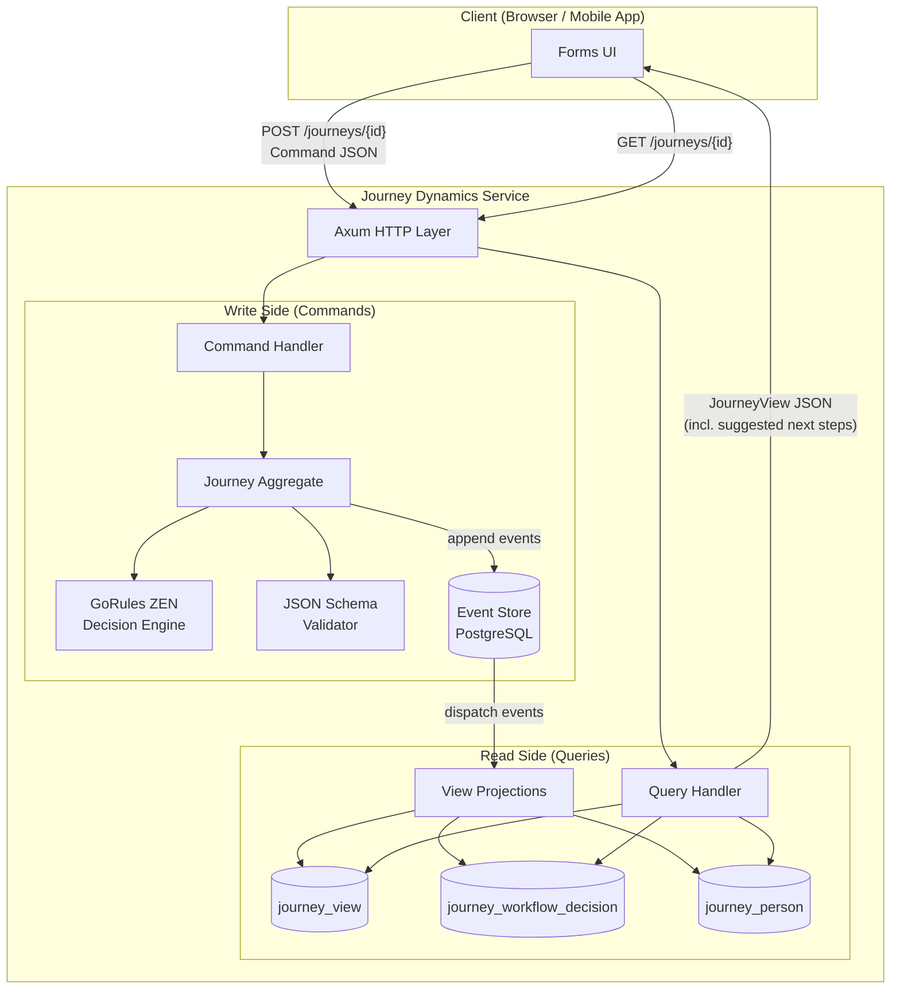

The service exposes a minimal HTTP API via [Axum](https://github.com/tokio-rs/axum):

- **`POST /journeys`** — Start a new journey (creates aggregate, emits `Started` event).
- **`POST /journeys/{id}`** — Submit a command (`Capture`, `CapturePerson`, `Complete`).
- **`GET /journeys/{id}`** — Query the materialised view of a journey.

Every `POST` flows through the write side; every `GET` flows through the read side. They share no mutable state at runtime — only the event store connects them, via asynchronous projection.

---

## Key Architectural Decisions

### 1. Event Sourcing

#### What it is

Rather than storing the "current state" of a journey in a mutable row, every state change is recorded as an immutable **event** in an append-only `events` table. The current state of any journey can be reconstructed by replaying its events in order.

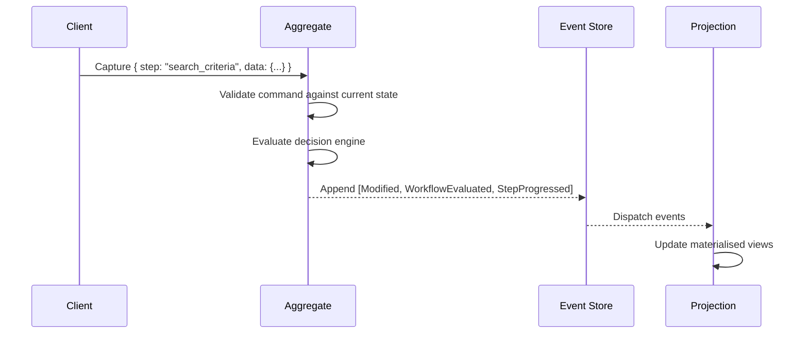

The events in this system are:

| Event | Purpose |
|---|---|
| `Started` | Journey created with a unique ID |
| `Modified` | User-supplied data captured for a named step |
| `PersonCaptured` | Structured personal data captured |
| `WorkflowEvaluated` | Decision engine produced a set of suggested next actions |
| `StepProgressed` | The current step transitioned from one value to another |
| `Completed` | Journey finalised; no further modifications permitted |

#### Why it is the right choice here

1. **Adaptive journeys produce non-linear histories.** A user may revisit steps, provide data that causes the system to skip or insert steps, or trigger error-recovery branches. A mutable-state model captures only the final snapshot; event sourcing captures the entire path, including abandoned branches and corrections.

2. **Auditability is a first-class requirement.** In regulated domains (financial services, travel, insurance), being able to answer "what data did the user provide, in what order, and what did the system recommend at each point?" is non-negotiable. The event stream is a complete, tamper-evident audit log.

3. **The decision engine needs accumulated context.** Every time new data arrives, the GoRules engine evaluates the full accumulated state to determine next steps. Event sourcing naturally maintains this accumulated state as a fold over the event stream, ensuring the engine always operates on a consistent, complete picture.

4. **Temporal queries become trivial.** "What did this journey look like at step 3?" is answered by replaying events up to sequence 3. This supports debugging, customer support, and analytics without additional infrastructure.

5. **Schema evolution is safer.** New event types can be added without migrating existing data. Old events retain their original shape. This is critical for a system where the set of journey steps — and therefore the set of possible events — will grow as new products are onboarded.

#### How it is implemented

The service uses the [`cqrs-es`](https://crates.io/crates/cqrs-es) and [`postgres-es`](https://crates.io/crates/postgres-es) crates, which provide a `PostgresCqrs` framework. Events are stored in a standard table:

```sql
CREATE TABLE events (
    aggregate_type TEXT    NOT NULL,
    aggregate_id   TEXT    NOT NULL,
    sequence       BIGINT  NOT NULL,
    event_type     TEXT    NOT NULL,
    event_version  TEXT    NOT NULL,
    payload        JSON    NOT NULL,
    metadata       JSON    NOT NULL,
    timestamp      TIMESTAMPTZ DEFAULT CURRENT_TIMESTAMP,
    PRIMARY KEY (aggregate_type, aggregate_id, sequence)
);
```

The compound primary key `(aggregate_type, aggregate_id, sequence)` guarantees event ordering and prevents write conflicts — a natural concurrency control that does not require locking.

---

### 2. CQRS (Command-Query Responsibility Segregation)

#### What it is

The system maintains strictly separate models for writing (the `Journey` aggregate, which processes commands and emits events) and reading (materialised SQL views, which project events into queryable tables).

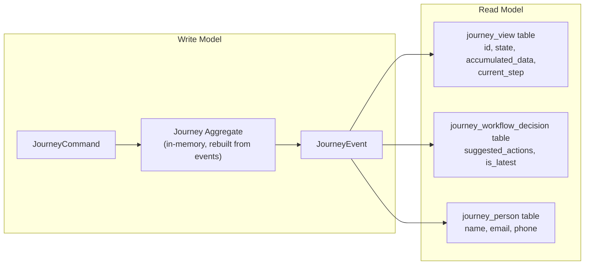

#### Why it is the right choice here

1. **Read and write concerns are genuinely different.** The write side must enforce invariants: "a completed journey cannot accept further data", "data must conform to the active schema", "the decision engine must be consulted on every capture". The read side must answer: "what is the current state of this journey, including what the UI should show next?" These concerns have different shapes, different performance profiles, and different rates of change.

2. **The UI needs a pre-computed "what next" view.** After every command, the front-end needs to know the current step, the accumulated data, and the decision engine's suggested next actions — all in a single, fast query. The `journey_view` and `journey_workflow_decision` tables are purpose-built for this, updated asynchronously as events are committed. The client never has to replay events or invoke the decision engine itself.

3. **Multiple read models can coexist.** The same event stream feeds the `journey_view` (for the UI), the `journey_person` table (for structured personal data queries like "find all journeys for this email"), and a logging query (for observability). New read models — analytics aggregations, compliance reports, search indexes — can be added by writing a new projection over the existing event stream, with zero impact on the write path.

4. **Scalability.** In a high-traffic scenario, the read side (which is hit on every form-step render) can be scaled independently of the write side (which is hit only on form submissions). Read replicas, caching layers, or dedicated read databases can be introduced without touching the aggregate logic.

#### How it is implemented

The `Journey` aggregate handles commands and applies events to its in-memory state:

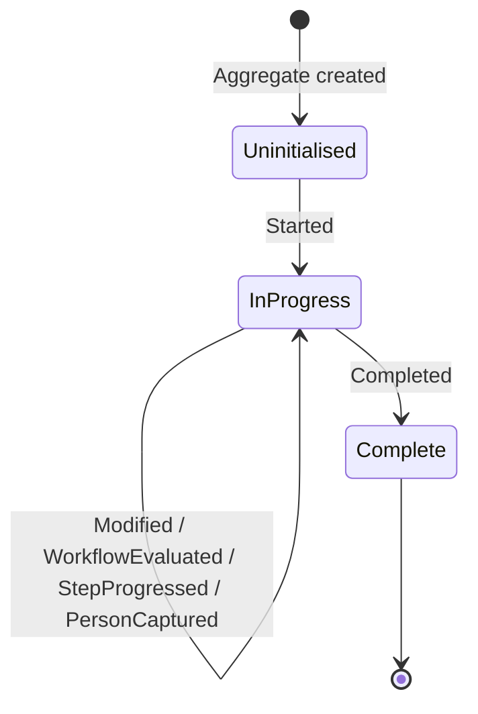

Events are dispatched to two query implementations:

- **`StructuredJourneyViewRepository`** — Projects events into three normalised SQL tables (`journey_view`, `journey_workflow_decision`, `journey_person`). This is the primary read model, consumed by the API's query endpoint.
- **`SimpleLoggingQuery`** — Logs every event to stdout for operational visibility.

The `JourneyView` returned to clients contains everything the UI needs to render the next form step:

```json
{
  "id": "b7e2c1a0-...",
  "state": "InProgress",
  "accumulated_data": { "origin": "JFK", "destination": "LAX", ... },
  "current_step": "outbound_selection",
  "latest_workflow_decision": {
    "suggested_actions": ["return_selection", "passenger_details"]
  }
}
```

---

### 3. GoRules ZEN Decision Engine

#### What it is

[GoRules ZEN](https://gorules.io/) is an embeddable business rules engine that evaluates JSON Decision Model (JDM) files — declarative graphs of decision tables, expression nodes, and switch nodes. In Journey Dynamics, the engine is invoked on every `Capture` command to determine what the user should do next.

The following diagram illustrates the structure of a JDM model using the **flight-booking example** that ships with the repository. This example is not part of the core engine — it is an illustrative journey used to demonstrate the architecture. A real deployment would supply its own JDM models and schemas for the products it supports.

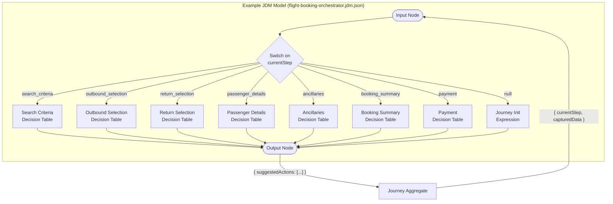

#### Why it is the right choice here

1. **Journey logic is inherently rule-driven, not code-driven.** The decision "what comes after search criteria?" depends on trip type, passenger count, user authentication status, and data completeness. These are business rules that change frequently — new products, new regulatory requirements, A/B tests — and should not require code changes. JDM files are declarative, version-controlled, and can be edited visually in the GoRules editor.

2. **Separation of orchestration from domain logic.** The aggregate enforces invariants (journey must be started, must not be completed, data must be valid). The decision engine handles orchestration (what step to show next). This separation means domain experts can modify journey flows without understanding Rust, and engineers can modify validation logic without understanding the business routing.

3. **Multiple JDM models for different concerns.** To illustrate this, the repository includes a **flight-booking example** (under `examples/flight-booking/`) that is entirely separate from the core engine. This example ships four models that demonstrate how a realistic product journey can be decomposed:
   - **`flight-booking-orchestrator.jdm.json`** — Step routing and flow control.
   - **`flight-validation-rules.jdm.json`** — Data validation rules per step.
   - **`flight-pricing-calculator.jdm.json`** — Dynamic pricing logic.
   - **`flight-error-handling.jdm.json`** — Error classification and recovery.

   Each model is independently deployable and testable. Onboarding a new product journey (e.g., insurance, hotel booking) means authoring new JDM models and a JSON schema — not writing new Rust code in the core service.

4. **The engine is embedded, not remote.** The ZEN engine runs in-process (via `zen-engine` crate), so decision evaluation adds microseconds, not milliseconds. There is no network hop, no separate service to deploy, no availability dependency. JDM files are plain JSON and can be loaded at runtime from any source (filesystem, S3, a configuration service, etc.), so new journey definitions or rule changes can be deployed without recompiling the core service. The current flight-booking example happens to embed its JDM file at compile time via `include_str!` for simplicity, but this is not a constraint of the architecture.

5. **Event sourcing provides the ideal input.** The decision engine receives the full `accumulated_data` and `current_step` — both of which are maintained by the aggregate's event-replay logic. This means the engine always evaluates against the complete, consistent state of the journey, not a partial or stale snapshot.

#### How it interacts with the aggregate

When a `Capture` command arrives:

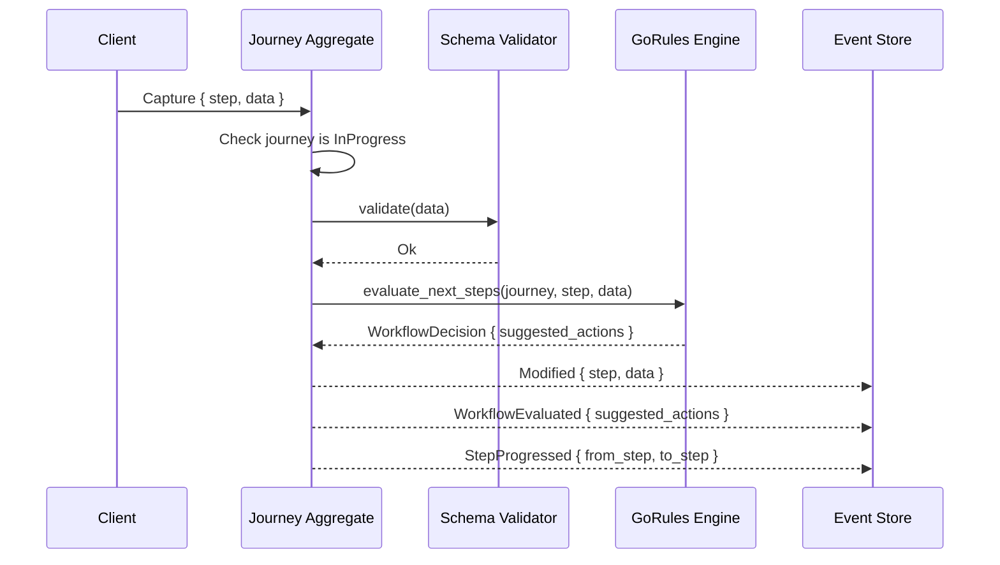

The engine's output (`suggested_actions`) is emitted as a `WorkflowEvaluated` event and projected into the `journey_workflow_decision` table. The front-end reads this on the next query and uses it to determine which form to render.

---

### 4. Rust as Implementation Language

#### Why it is appropriate here

1. **Correctness.** The type system encodes domain invariants at compile time. Commands, events, and view models are distinct types — it is impossible to accidentally use an event where a command is expected. The `enum`-based command and event models with exhaustive `match` ensure every variant is handled.

2. **Performance.** The decision engine evaluation, JSON schema validation, and event replay are all CPU-bound operations that benefit from Rust's zero-cost abstractions. There is no GC pause to disrupt latency-sensitive command processing.

3. **Ecosystem fit.** The `cqrs-es` / `postgres-es` crates provide a mature, idiomatic CQRS + Event Sourcing framework. The `zen-engine` crate embeds the GoRules engine natively. `axum` provides a lightweight, async HTTP layer. `sqlx` provides compile-time-checked SQL queries.

4. **Reliability.** In a system where events are the source of truth and data loss is unacceptable, Rust's ownership model and `Result`-based error handling reduce the surface area for runtime failures. No null pointer exceptions, no unhandled exceptions silently swallowing events.

---

## Domain Model

### Aggregate: Journey

The `Journey` aggregate is the central domain object. It maintains:

| Field | Type | Purpose |
|---|---|---|
| `id` | `Uuid` | Unique journey identifier |
| `state` | `JourneyState` | `InProgress` or `Complete` |
| `accumulated_data` | `serde_json::Value` | Merged JSON of all captured data |
| `current_step` | `Option<String>` | The most recent step name |
| `latest_workflow_decision` | `Option<WorkflowDecisionState>` | Last decision engine output |

### Commands

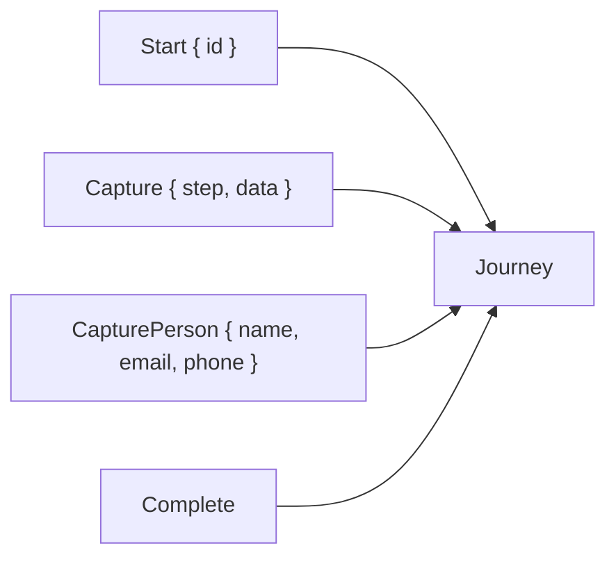

#### `Start { id }`

- **Preconditions:** Journey does not already exist
- **Events produced:** `Started`

#### `Capture { step, data }`

- **Preconditions:** Journey is `InProgress`, data passes schema validation
- **Events produced:** `Modified`, `WorkflowEvaluated`, optionally `StepProgressed`

#### `CapturePerson { ... }`

- **Preconditions:** Journey is `InProgress`
- **Events produced:** `PersonCaptured`

#### `Complete`

- **Preconditions:** Journey is `InProgress`
- **Events produced:** `Completed`

### Events

All events implement `DomainEvent` and are serialised to JSON in the event store. Each carries a version string (`"1.0"`) to support future schema evolution.

### Services

The aggregate depends on two injected services (via the `JourneyServices` struct), both expressed as trait objects for testability:

- **`DecisionEngine`** — Evaluates next steps given the current journey state.
- **`SchemaValidator`** — Validates captured data against a JSON Schema.

---

## Data Flow

### Complete Journey Lifecycle

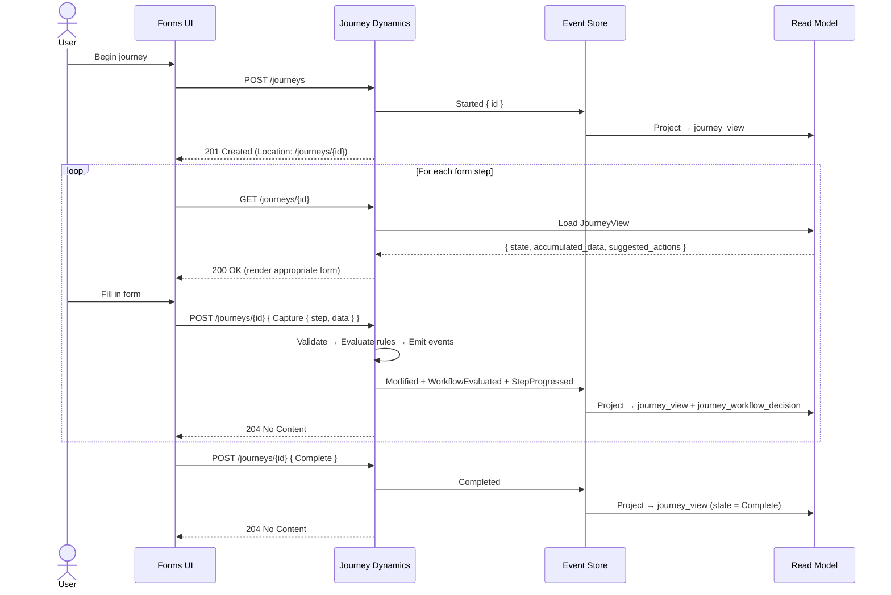

### Adaptive Step Resolution

This is the core of the system's value. The front-end does not hard-code a step sequence. Instead, after every submission, it queries the journey and reads `latest_workflow_decision.suggested_actions` to determine what to render next.

To make this concrete, here is how the flight-booking example (not part of the core engine) uses this mechanism to branch based on user input:

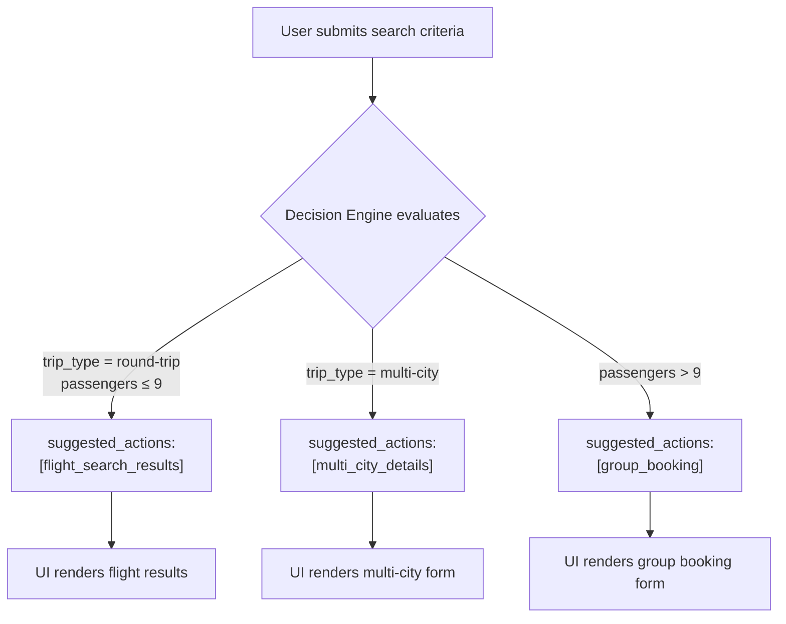

The step names and branching logic shown above are specific to the flight-booking example. The core engine is product-agnostic — it simply passes accumulated data to whatever JDM model is configured and relays the resulting `suggested_actions` to the client.

This means:

- **Adding a new product** (e.g., hotel booking) requires a new JDM model and JSON schema — no changes to the Journey Dynamics service code.
- **Modifying a flow** (e.g., adding a visa-check step for international flights) requires editing the JDM decision table — no deployment of the core service (if JDM models are loaded dynamically; currently they are compiled in, so a rebuild is needed, but no code changes).
- **A/B testing flows** can be achieved by routing to different JDM models based on user cohort.

---

## Schema & Validation Strategy

Data captured at each step is validated against a **JSON Schema** (Draft 2020-12) before the aggregate accepts it. The core engine accepts any schema — the specific schema is a product concern, not an engine concern. To demonstrate the approach, the flight-booking example generates its schema from Rust types using `schemars`, ensuring compile-time alignment between the domain model and validation rules.

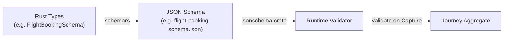

This provides:

- **Type-driven validation:** In the example, the schema is derived from the same Rust types used to deserialise data, so they cannot drift apart. Other products may author schemas by hand or generate them from other sources — the core engine is indifferent.
- **Product-specific schemas:** Each journey type (flight booking, insurance, etc.) has its own schema. The active schema is injected at service configuration time.
- **Progressive validation:** In the flight-booking example, top-level groups (`search`, `searchResults`, `booking`) are optional, allowing the journey to accumulate data incrementally while still enforcing constraints within each group when present. Other product schemas can adopt the same pattern.

---

## Deployment & Infrastructure

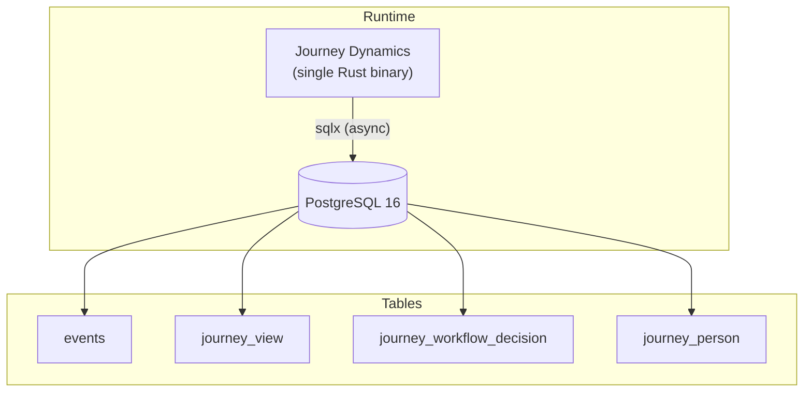

| Component | Details |
|---|---|
| **Application** | Single stateless binary; scales horizontally behind a load balancer. Aggregate state is rebuilt from PostgreSQL on each command (or from snapshots, if configured). |
| **Database** | PostgreSQL 16. All tables (event store + read models) live in the same database. Migrations managed via `sqlx-cli`. |
| **Decision Engine** | Embedded in-process. No external service dependency. JDM models are plain JSON, loadable at runtime from filesystem, S3, or a configuration service — no recompilation required to change journey logic. |
| **Infrastructure** | Docker Compose for local development. Production deployment is a standard container + managed PostgreSQL. |

---

## Trade-offs & Risks

| Concern | Assessment | Mitigation |
|---|---|---|
| **Event store growth** | Every interaction produces 2-3 events. High-volume journeys will grow the events table. | Snapshots (supported by `cqrs-es`), event archival, and partitioning. Read models are independent and can be rebuilt. |
| **Eventual consistency** | Read models are updated asynchronously after events are committed. A query immediately after a command may return stale data. | In practice, projection is synchronous within the same request (events are dispatched in-process before the HTTP response). For truly distributed read replicas, clients should use the `Location` header or event sequence for consistency. |
| **JDM model complexity** | As journey flows grow, JDM files can become large and hard to reason about. | The GoRules visual editor provides a graph-based editing experience. Models are decomposed by concern (orchestration, validation, pricing, errors). Each is independently testable. |
| **Compiled-in JDM models** | Currently, JDM and schema files are embedded at build time. Changing a rule requires a rebuild. | This is a deliberate trade-off for determinism and simplicity. A future enhancement could load models from a configuration store (S3, database, or config service) with hot-reload capability. |
| **Single-aggregate design** | All journey state lives in one aggregate type. Very long journeys with many events could slow aggregate reconstruction. | Snapshotting mitigates replay cost. The aggregate is intentionally lean — heavy data (person records, workflow decisions) is projected to the read side and not stored in aggregate state. |

---

## Appendix: Technology Choices

| Dependency | Version | Purpose |
|---|---|---|
| `cqrs-es` | 0.4.12 | CQRS + Event Sourcing framework |
| `postgres-es` | 0.4.12 | PostgreSQL-backed event store and view repositories |
| `zen-engine` | 0.52.2 | GoRules ZEN decision engine (embedded) |
| `axum` | 0.8.8 | Async HTTP framework |
| `sqlx` | 0.8.6 | Async PostgreSQL driver with compile-time query checking |
| `serde` / `serde_json` | 1.0 | Serialisation framework |
| `jsonschema` | 0.37 | JSON Schema validation (Draft 2020-12) |
| `schemars` | 1.1.0 | JSON Schema generation from Rust types |
| `json-patch` | 4.1.0 | RFC 7386 JSON Merge Patch for accumulating data |
| `uuid` | 1.19.0 | Journey identity |
| `tokio` | 1.x | Async runtime |
| `chrono` | 0.4.42 | Timestamp handling in metadata |

---

*Prepared for review by the Architecture Review Board. Questions and feedback welcome.*
