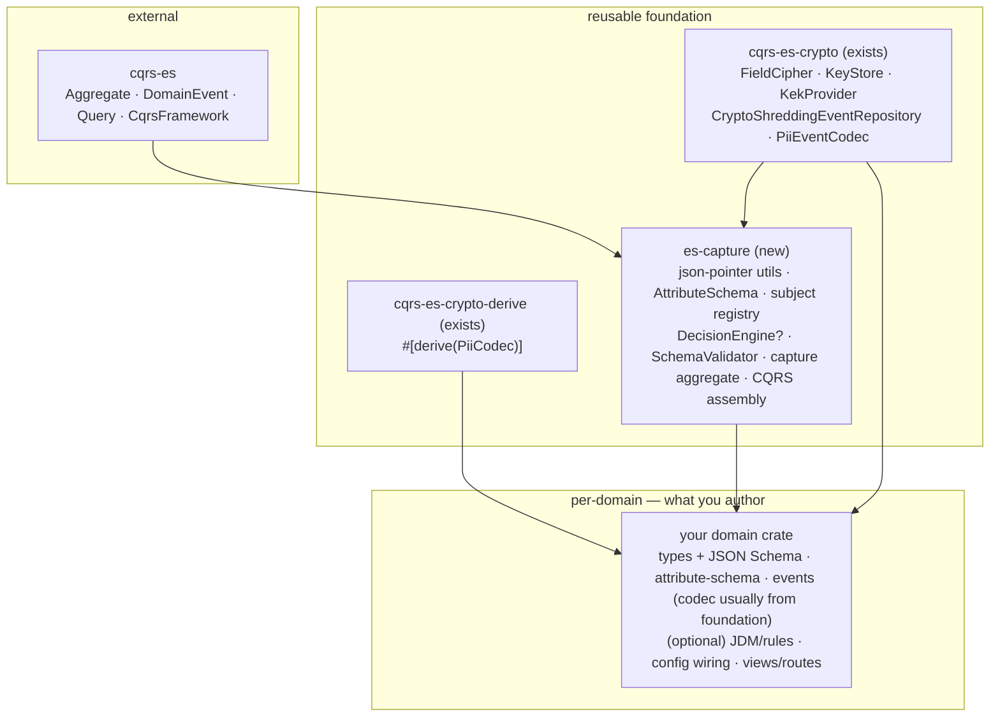

# A Reusable Event-Sourcing Foundation

**Status:** Implemented · **Audience:** Architects & engineers building new event-sourced systems

## Implementation status

The extraction described below is **complete**. The domain-agnostic spine now lives in the
`es-capture` crate and the flight-booking `Journey` is a thin shell over it — proving the
foundation end-to-end (its full test + hurl suite runs through the generic path).

`crates/es-capture` modules:

| Module | Contents |
|---|---|
| `json_path` | `flatten` / `assign_all` over `jsonptr` pointers |
| `attribute_schema` | `PiiClass`, `AttributeEntry`, `NamespacePattern`, `AttributeSchema`, `classify_changes`, config types |
| `schema_validator` | `SchemaValidator` trait, `JsonSchemaValidator`, `NoOpValidator` |
| `decision_engine` | `DecisionEngine` trait (decoupled from any aggregate; takes `&Value` state), `GoRulesDecisionEngine`, `SimpleDecisionEngine`, `WorkflowDecision` |
| `subject_registry` | `SubjectRegistration`, `SubjectRegistry` (register/bind/forget + the bound-non-forgotten invariant `resolve_active`), `SubjectError` |
| `capture` | `capture(...)` pipeline → `CaptureOutcome` (classify → validate → optional engine); `SecretSlice`, `CaptureError` |
| `attributes_set_codec` | `AttributesSetCodec` — the generic partition-aware `PiiEventCodec` for the `AttributesSet` event |
| `aggregate` | `CaptureAggregate<C: CaptureConfig>` (a `cqrs_es::Aggregate`), shared `CaptureCommand` / `CaptureEvent` (+ `SecretPartitionData`) / `CaptureError` / `CaptureServices` (optional engine) / `CaptureState` |

What a new domain writes — confirmed by `journey_dynamics` now being exactly this: a `CaptureConfig`
(just the aggregate `TYPE`), an attribute schema, a JSON schema, optional JDM rules, and its
views/routes. `journey_dynamics::domain::journey` is just
`pub type Journey = CaptureAggregate<JourneyConfig>` plus re-exports of the generic types under the
historical `Journey*` names; `commands`/`events` re-export `CaptureCommand`/`CaptureEvent`.

Notable decisions taken during implementation:

- **Legacy events removed.** Backward-compat with previously-persisted event formats is no longer
  required (no existing users), so `PersonCaptured` / `PersonDetailsUpdated` / `Modified` /
  `StepProgressed` and all their handling were deleted. This is what let `JourneyEvent` become the
  pure generic spine and `JourneyPiiCodec` become the fully generic `AttributesSetCodec`.
- **Decision engine is optional** (`Option<Arc<dyn DecisionEngine>>` in `CaptureServices`):
  `WorkflowEvaluated` is emitted only when an engine is configured.
- **Generic error carries the full `role_path`** (`CaptureError::SubjectNotResolved(PointerBuf)`) —
  no domain-specific `/persons/` stripping.
- **Vestigial `current_step`** column/field removed (a forward migration).

The blueprint and reference map below remain the guide for building the next domain (e.g. an HR
system) on the foundation.

## Problem

This repository contains a production-grade, event-sourced engine that drives **progressive
data capture** under **dynamic (externalised) rules**, with **per-subject crypto-shredding**
for GDPR right-to-erasure. It is proven by a single consumer — the flight-booking example —
but the domain-agnostic machinery is interleaved with that domain's `Journey` naming inside the
`journey_dynamics` crate.

We want to build *other* systems on the same architecture without re-implementing the spine each
time. This document:

1. Classifies every meaningful module as **reusable as-is**, **generalise-then-extract**, or
   **domain-specific**.
2. Proposes a **crate layering** that turns the spine into a shared foundation.
3. Gives an ordered **extraction plan** to get there without behaviour change.
4. Gives a **blueprint** for assembling a brand-new domain on top.

The team has done this before: `cqrs-es-crypto` was already lifted out of the application
(see [`CRYPTO_CRATE_EXTRACTION.md`](./CRYPTO_CRATE_EXTRACTION.md)) and a derive macro
(see [`PII_CODEC_DERIVE_MACRO.md`](./PII_CODEC_DERIVE_MACRO.md)) removes the codec boilerplate for
fixed-schema events. This doc extends that direction to the rest of the spine — while noting where
the derive macro stops being the right tool (see *codec authoring* below).

## The reuse thesis

> A new event-sourced domain on this architecture is mostly **configuration + types + (optional)
> rules** — not new aggregate code.

The crypto layer is already generic. The capture spine (path-keyed attributes, attribute
classification, subject registry/binding, validation) is generic in substance and only
domain-named today. The decision engine is an *optional, pluggable* concern whose role varies by
system. What a new domain genuinely owns is its data shapes, its privacy schema, and — only if it
needs dynamic behaviour — its rules.



## Reuse classification

| Module / file | Verdict | Notes |
|---|---|---|
| `cqrs-es-crypto/src/{cipher,key_store,kek,repository,rewrap}.rs` | **As-is** | Fully generic: AES-256-GCM field cipher, per-subject DEKs, KEK wrap/rotation, `PiiEventCodec`-driven repository. No domain terms. |
| `cqrs-es-crypto-derive/src/lib.rs` | **As-is (narrow fit)** | `#[derive(PiiCodec)]` works for variants with compile-time-known secret fields and exactly one subject. Not a fit for the multi-role partition model (see *codec authoring*). |
| `journey_dynamics/src/domain/json_path.rs` | **As-is → extract** | `flatten` / `assign_all` over `jsonptr` pointers. Zero domain knowledge. |
| `journey_dynamics/src/domain/attribute_schema.rs` | **Generalise & extract** | `PiiClass`, `AttributeEntry`, `NamespacePattern`, `AttributeSchema`, `classify_changes`. Already generic over field names; only lives in the wrong crate. |
| Subject registry / bindings inside `domain/journey.rs` | **Generalise & extract** | `SubjectRegistration`, `bindings: BTreeMap<PointerBuf, Uuid>`, register/bind/forget logic + the "secret path needs a bound, non-forgotten subject" invariant. |
| Capture aggregate logic inside `domain/journey.rs` | **Generalise & extract** | classify → validate → emit `AttributesSet` (+ optional `WorkflowEvaluated`) → merge-patch into `shared_data`. Generic minus the name. |
| `services/decision_engine.rs` | **Generalise & extract (optional)** | `DecisionEngine` trait + `GoRulesDecisionEngine` + `SimpleDecisionEngine`. Make it optional for the spine (see decisions). |
| `services/schema_validator.rs` | **Generalise & extract** | `SchemaValidator` trait + `JsonSchemaValidator`. Generic JSON-Schema validation of plaintext changes. |
| `config.rs` (`CryptoCqrs`, `cqrs_framework`) | **Generalise & extract** | The assembly that wires repository + crypto + queries + services. Becomes a builder in `es-capture`. |
| `view_repository.rs`, `subject_lookup_hook.rs` | **Generalise pattern** | Projection + persist-hook/secondary-index pattern is reusable; the concrete tables are domain-specific. |
| `route_handler.rs`, `command_extractor.rs` | **Generalise pattern** | HTTP entry points reuse the extractor/route shape; concrete routes are domain choices. |
| `pii_codec.rs` (`JourneyPiiCodec`) | **Domain-specific (hand-written by design)** | Routes the multi-partition `AttributesSet` event, whose partitions are determined at runtime by role bindings. This flexibility is why it is hand-written; the derive macro covers only the simpler fixed-schema variants. See *codec authoring*. |
| `domain/{commands,events}.rs` *names* | **Domain-specific (shape is generic)** | The *shapes* (`SetAttributes`, `AttributesSet`, subject events) are the reusable contract; the enum identity is the domain's. |
| flight-booking schema JSON / JDM / Rust types | **Domain-specific** | The canonical example of what a domain authors. |

## The progressive-capture spine, generalised

The reusable contract, independent of any domain:

- **Path-keyed attributes.** Commands carry a flat `BTreeMap<PointerBuf, Value>` of RFC-6901 JSON
  Pointers → values. `flatten` / `assign_all` (`domain/json_path.rs`) convert between flat and
  nested; accumulation into `shared_data` is JSON merge-patch.

- **Classification.** `AttributeSchema` resolves each path to a `PiiClass`:

  ```rust
  pub enum PiiClass {
      Plaintext,
      Secret { subject: PointerBuf }, // DEK owner, e.g. "/persons/0"
  }
  ```

  via exact entries, `NamespacePattern`s (`<prefix>/<ref>/<field>` with `plaintext_suffixes`),
  plaintext prefixes, and an optional permissive fallback. `classify_changes` returns
  `{ plaintext, secret_by_subject, unknown }`. `AttributeEntry` is deliberately extensible (it
  carries `pii_class` today; designed to hold type/validation/display metadata later).

- **Subject registry & role bindings.** A subject is an `(id, email, forgotten)` record; a binding
  maps a `role_path` (`PointerBuf`) to a `subject_id`. Generic commands/events:
  `RegisterSubject`, `BindSubject`, `RegisterAndBindSubject`, `ForgetSubject` →
  `SubjectRegistered`, `SubjectBound`, `SubjectForgotten`. **Invariant:** a secret path can only be
  written if its subject is bound and not forgotten.

- **Capture events.** A `SetAttributes` command emits `AttributesSet { plaintext, secret_partitions }`
  where each `SecretPartitionData { role_path, subject_id, changes }` is one subject's secret slice.
  The `role_path` doubles as the crypto label (AAD).

- **Crypto interception.** `CryptoShreddingEventRepository` calls the domain's `PiiEventCodec` to
  extract each partition, encrypts under the subject's DEK on write, and decrypts on read — or
  **redacts** when the DEK is gone (= shredded). The aggregate is oblivious to encryption.

- **Optional rules.** When configured, a `DecisionEngine` evaluates the merged state and the spine
  emits `WorkflowEvaluated { suggested_actions, phase }`. **The spine accumulates attributes and
  runs the crypto path whether or not an engine is present.**

## Design decision — the decision engine is pluggable and optional

The current role (`suggested_actions` + `phase`) is *one* mode. Systems sit on a spectrum:

| System shape | Role of dynamic rules | Engine? |
|---|---|---|
| Guided / progressive-capture journey (today's flight-booking) | Compute suggested next steps + phase to drive a non-linear flow | Yes; emits `WorkflowEvaluated` |
| Record-of-truth / state management | Policy/eligibility gating, derived-attribute computation, or lifecycle/status transitions | Maybe; different output shape |
| Pure ledger | None — append events and project | No |

**Recommendation.** Keep the `DecisionEngine` trait but:

1. Make it **optional** in the aggregate and config — model the slot as `Option<Arc<dyn DecisionEngine>>`
   (or a `NoopDecisionEngine`). The capture events (`AttributesSet`, subject events) stand alone;
   `WorkflowEvaluated` is emitted **only** when an engine is configured.
2. Frame its output as a generic **evaluation result** the domain interprets, rather than baking in
   "suggested next steps" as the only meaning. `WorkflowDecision { suggested_actions, phase }` is the
   journey interpretation; a record-of-truth domain might interpret a result as an
   allow/deny verdict or a set of derived attributes.

This keeps a record-of-truth system from inheriting journey semantics it does not want.

## Design decision — codec authoring: derive vs hand-written

The `PiiEventCodec` is the seam between the domain's events and the crypto layer. There are two
ways to author it, and **the multi-role subject model pushes the recommended path toward
hand-written** for the core capture event.

`#[derive(PiiCodec)]` is excellent for variants whose PII shape is **fixed at compile time**:

- exactly one `#[pii(subject)]` field per variant (one subject per event), and
- a statically-known set of `#[pii(secret)]` fields (e.g. `name`, `email`, `phone`).

That is the shape of legacy single-subject events like `PersonCaptured` — and there the macro
rightly deletes ~200 lines of boilerplate.

The path-keyed, multi-role capture event does **not** have that shape:

- `AttributesSet` carries `secret_partitions: Vec<SecretPartitionData>` — **N subjects in one
  event**, where N is decided at runtime by which role paths the command touched;
- each partition's `changes` is a dynamic `BTreeMap<PointerBuf, Value>` — the secret *fields are
  not known at compile time*; and
- the crypto label / AAD is the per-partition `role_path`, not a single fixed sentinel.

A static, field-annotation-driven derive cannot express "one partition per runtime-bound subject,
each with an open-ended set of fields." This is precisely why `JourneyPiiCodec` is hand-written.

**Recommendation.**

1. Treat the **partition-aware, hand-written `PiiEventCodec`** as the *primary* codec pattern for
   any domain that adopts the multi-role/path-keyed capture event. Provide it in `es-capture` as a
   ready-made, reusable codec for the standard `AttributesSet` shape — so most domains get it for
   free and never hand-write anything, because the partition contents are generic
   (`role_path` → encrypted `changes`), not domain-specific.
2. Keep `#[derive(PiiCodec)]` available for **domain-specific auxiliary events** that genuinely have
   a fixed single-subject PII shape.
3. *(Future work)* a partition-aware extension to the derive macro could annotate a
   `Vec<Partition>` field (`#[pii(partitions, subject = subject_id, label = role_path, secret =
   changes)]`) — but it is not needed if `es-capture` ships the generic partition codec, since the
   capture event's shape is the same across domains.

The net effect: new domains rarely write codec code at all — not because the derive macro covers
the flexible case, but because the flexible case is **generic** and lives in the foundation.

## Design decision — generic aggregate vs building blocks (hybrid)

`JourneyServices` already bundles the spine's collaborators behind trait objects:

```rust
pub struct JourneyServices {
    decision_engine: Arc<dyn DecisionEngine>,   // → Option<...> after the change above
    schema_validator: Arc<dyn SchemaValidator>,
    attribute_schema: Arc<AttributeSchema>,
}
```

Provide **both**:

- **Building blocks** — subject registry, classifier, accumulator, decision call, codec hookup — so
  a domain that needs extra commands/invariants composes its own aggregate.
- **A default `CaptureAggregate`** for the common case: a domain supplies config (attribute schema,
  validator, optional engine) and gets the standard capture behaviour with no aggregate code.

Mechanically, parameterise the services bundle (generics or trait objects) so collaborators are
domain-supplied and the decision-engine slot can be empty.

## Extraction plan (phased, behaviour-preserving) — **done**

`crates/es-capture` was created and the spine moved in dependency order, running the full test +
hurl suite after each step so behaviour stayed identical:

1. ✅ **`json_path`** (no internal deps) — moved first.
2. ✅ **`attribute_schema`** + `classify_changes` — public API identical (re-exported).
3. ✅ **`SchemaValidator`** + **`DecisionEngine`** (trait decoupled from the aggregate).
4. ✅ **Subject registry / bindings** — lifted into `subject_registry`.
5. ✅ **Capture aggregate** — `capture` pipeline + generic `AttributesSetCodec` + generic
   `CaptureAggregate`; `Journey` reduced to `CaptureAggregate<JourneyConfig>`. (The engine was made
   optional here.) Legacy events were removed first, which simplified this step substantially.
6. ✅ **Assembly** — `journey_dynamics::config` still wires the concrete `Journey` stack; the
   collaborators it wires (codec, validator, engine, schema, services) are now all generic. A
   dedicated `es-capture` builder + generic view-projection/persist-hook abstraction is the natural
   next refinement when the second domain lands.
7. ✅ **Proven** — `journey_dynamics`/flight-booking run entirely through `es-capture`'s generic
   aggregate and partition codec; the full hurl suite (incl. shredding) passes unchanged.

## Blueprint — building a new domain on the foundation

Depend on `es-capture` + `cqrs-es-crypto`, then:

1. **Define domain types** and generate a JSON Schema from them (schemars; see
   `examples/flight-booking/src/bin/generate_schema.rs`).
2. **Author the attribute schema** — plaintext prefixes, exact entries, and `NamespacePattern`s for
   any role hierarchies (which fields are secret per subject).
3. **(Optional) Decide the dynamic-rules role** — guided next-steps, policy gating, derivation, or
   none. If used, author a JDM model for `GoRulesDecisionEngine` or implement a custom
   `DecisionEngine`. If not, omit it entirely — the system is pure capture + project.
4. **Define events.** For the path-keyed capture event, reuse the foundation's generic partition
   codec — no codec code to write. Reach for `#[derive(PiiCodec)]` only for any auxiliary events
   with a fixed single-subject PII shape. Then choose the default `CaptureAggregate` or compose the
   building blocks for bespoke invariants/commands.
5. **Wire the framework** — KEK provider, key store, codec, schema validator, and a decision engine
   *only if used* (mirror `cqrs_framework` in `config.rs`).
6. **Migrations** — reuse the generic event-store and key-store tables; add domain view tables (or
   start with a generic JSONB view).
7. **Entry points** — expose HTTP (or other) endpoints reusing the command-extractor/route patterns.

## Temporal & effective-dated data

Many systems-of-record need to record a fact that becomes true at a *future* (or past) point in
time — a price change scheduled for next quarter, a status that takes effect on a given date, a
correction backdated to when it should have applied. This is a **valid-time** (effective-time)
concern, and it is orthogonal to what event sourcing gives you for free.

- **Transaction time** — *when the system learned a fact* — is intrinsic to the event log (event
  sequence + timestamps). You get full "what did we believe, and when" history with no extra work.
- **Valid time** — *when the fact is true in the world* — is a **domain-modelling concern the spine
  does not address out of the box.** It must be modelled explicitly.

### The tension to be aware of

The capture aggregate accumulates attributes by **JSON merge-patch into `shared_data`, where the
latest write to a path wins** and represents the current value. That is correct for "the value as
last stated", but wrong for effective-dated values: a change recorded *today* but effective *later*
must not read as current *now*. Don't store an effective-dated field as a plain scalar that the
merge-patch overwrites.

### Modelling valid time within this architecture (no framework changes)

1. **Append future/past-dated events; never mutate.** Record the change *now* (transaction time =
   now) carrying its `effective_from` (and optionally `effective_to`). A scheduled change is simply
   another event recorded today — which is exactly the append-only grain ES already has.
2. **Represent effective-dated fields as a timeline, not a scalar.** The path-keyed / `jsonptr`
   model suits this well: hold dated entries (e.g. `/<field>/<effective_from>` → value) so
   merge-patch accumulates the timeline instead of clobbering it. Classification still works — a
   `NamespacePattern` over the field's prefix marks the whole timeline secret for its subject.
3. **Resolve "current as-of" as a derived projection.** Make the current value a *view computed
   from the timeline* (latest entry whose `effective_from <= as_of`, not superseded), and expose
   as-of-any-date queries on the read side. This is the CQRS split already in place: current state
   is a projection, not stored truth. No scheduler is needed to "apply" a future change — it
   materialises when a read crosses the effective date. A background job is only required if
   something external must *fire* on that date (e.g. notify a downstream system).

### Interactions

- **Optional decision engine.** If rules depend on effective-dated state, pass the **as-of date as
  an explicit input** so the engine evaluates against the correct slice of the timeline.
- **Validation.** Effective-dated structures are just part of the JSON Schema the `SchemaValidator`
  checks; no special support needed.
- **Crypto-shredding.** Unaffected — a subject's whole timeline is encrypted under that subject's
  DEK and shreds atomically.

## Constraints & caveats

- **Long-lived aggregates vs unencrypted snapshots.** Snapshots speed up replay of long event
  streams, but `cqrs-es-crypto` only shreds PII in individual *events* — **snapshots are not
  encrypted** (`repository.rs` `get_snapshot`). For short-lived aggregates this rarely matters (the
  app uses `new_event_store`, i.e. no snapshots today). For long-lived, PII-bearing records it does:
  a snapshot would retain decrypted PII a shred could not reach. Options: keep PII out of
  snapshotted aggregate state (project it to read models, as the current design already leans
  toward), or add encrypted snapshots before enabling them. This is a "when you scale replay"
  decision, not a day-one blocker.
- **View consistency.** Read models are eventually consistent in principle (synchronous within a
  request in practice). Design reads accordingly.
- **`cqrs-es` conventions.** Mind `aggregate_type` strings and `event_type` / `event_version` for
  forward/backward compatibility (note how `WorkflowEvaluated` versions `phase` via
  `#[serde(default)]`, and how `SecretPartitionData` accepts the legacy `person_ref`).
- **Secondary index carries PII policy.** The persist-hook/lookup table (e.g. email → subject for
  erasure-by-email) is privacy-sensitive and must be designed deliberately per domain.

## Reference file map

| Reusable piece | Source today |
|---|---|
| Field cipher / DEK / KEK / crypto repository | `crates/cqrs-es-crypto/src/{cipher,key_store,kek,repository,rewrap}.rs` |
| Codec derive | `crates/cqrs-es-crypto-derive/src/lib.rs` |
| JSON-pointer flatten/assign | `crates/journey_dynamics/src/domain/json_path.rs` |
| Attribute classification | `crates/journey_dynamics/src/domain/attribute_schema.rs` |
| Subject registry + capture aggregate | `crates/journey_dynamics/src/domain/journey.rs` |
| Generic command/event shapes | `crates/journey_dynamics/src/domain/{commands,events}.rs` |
| Decision engine / validator | `crates/journey_dynamics/src/services/{decision_engine,schema_validator}.rs` |
| Assembly / projection / persist hook | `crates/journey_dynamics/src/{config,view_repository,subject_lookup_hook,route_handler,command_extractor}.rs` |
| Codec migration target | `crates/journey_dynamics/src/pii_codec.rs` |
| Reference consumer | `examples/flight-booking/**` |
| Prior art (style + precedent) | `docs/{ARCHITECTURE_REVIEW,MULTI_SUBJECT_DESIGN,PATH_KEYED_ATTRIBUTES_DESIGN,CRYPTO_CRATE_EXTRACTION,PII_CODEC_DERIVE_MACRO}.md` |
